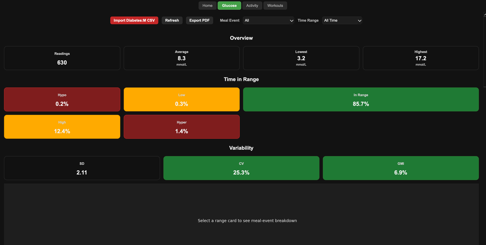
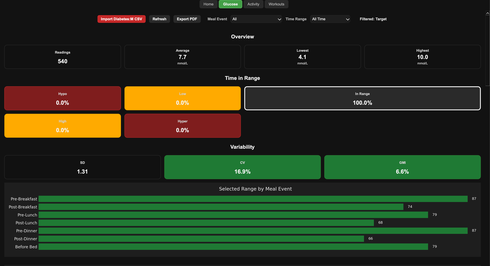
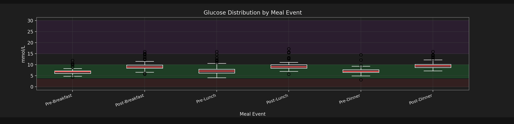
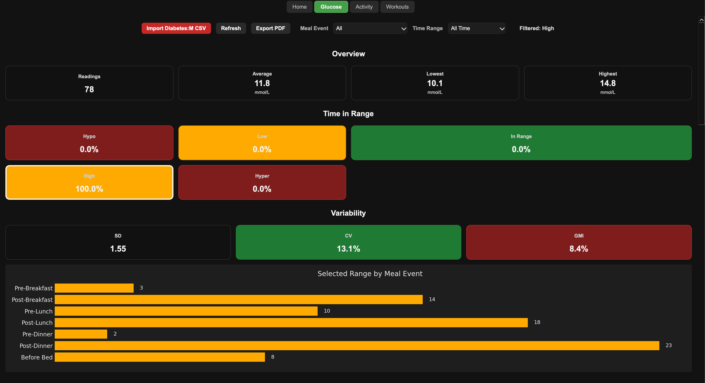
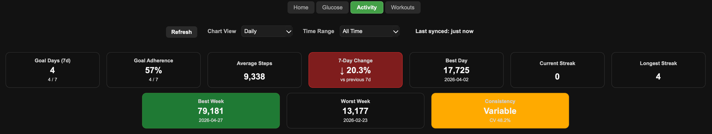
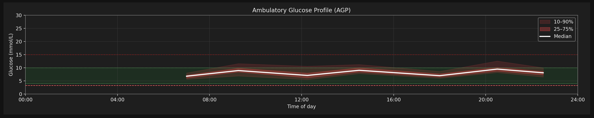

# RigLog


RigLog is a desktop health analytics application for analysing glucose, activity, workouts, nutrition, and cross-module health patterns.

It transforms raw health data into structured insights through:

- Time-in-range analysis
- Variability metrics (SD, CV, GMI)
- Meal-event breakdowns
- Fitbit activity analysis
- Daily and intraday glucose/activity comparisons
- Interactive filtering and drill-down

Built with a service-layer architecture, RigLog separates data processing from UI, enabling scalable and consistent analytics across features.

> ⚠️ No external services required to run RigLog locally.

## Contents

- [Demo Data](#-demo-data)
- [Demo](#-demo)
- [Features](#️-features)
- [Why RigLog?](#why-riglog)
- [Tech Stack](#tech-stack)
- [Architecture Overview](#architecture-overview)
- [Design Decisions](#design-decisions)
- [Project Status](#project-status)
- [Quick Start](#-quick-start)
- [Optional: Connect Fitbit](#-optional-connect-fitbit)

## 🧪 Demo Data

RigLog includes artificial example data for safe local testing and screenshots.

Example files live in:

```text
docs/examples/
```

### Create local importable CSV files

```bash
mkdir -p data/demo
cp docs/examples/demo_glucose.csv.example data/demo/demo_glucose.csv
cp docs/examples/sample_workout_log.csv.example data/demo/sample_workout_log.csv
```

Screenshots in this README use synthetically generated glucose data.

The demo pipeline uses a separate SQLite database and reproducible data generation scripts.

This allows the application to demonstrate:

- Realistic variability and patterns
- Time-in-range distribution
- Meal-event behaviour

without exposing personal health data.

The workout example data supports testing the spreadsheet-style workout import flow without using real training logs.

## 🎬 Demo

A quick walkthrough showing navigation and range-based filtering in action.

<video src="assets/docs/riglog_demo.mp4" controls width="800"></video>

<p>
If the video does not display, <a href="assets/docs/riglog_demo.mp4">click here to view the demo</a>.
</p>

## ⚙️ Features

- Import glucose data from Diabetes:M (CSV)
- Interactive glucose dashboard with:
  - Ambulatory Glucose Profile (AGP)
  - Time-in-range metrics
  - Clickable glucose range filters
  - Meal-event drilldown chart
  - Unified active-filter state display
  - Daily average trends
  - Meal-event glucose distribution
  - Daily glucose vs steps comparison chart
  - Intraday glucose readings vs step-density chart
- Glucose variability metrics:
  - Mean, SD, CV, GMI
- Insulin dose effectiveness analysis:
  - Standard vs actual carb ratios
  - Outcome-based recommendations
- Time-based improvement tracking (7-day comparison)
- Editable fields:
  - Carbohydrates (g)
  - Humalog (u)
  - Tresiba (u)
  - Notes
- Export professional PDF reports with charts
- Activity tracking via Fitbit integration:
  - Daily step import and sync
  - Intraday steps and calorie burn import
  - Background sync and token refresh
  - 7-day and 14-day rolling goal adherence
  - Best/worst weekly step summaries
  - Step consistency analysis using coefficient of variation (CV)
  - Streak and trend analysis
  - Daily and weekly charts with hover insights
- Workout analytics:
  - Spreadsheet-style workout CSV import
  - Seeded workout exercise catalogue with Push, Pull, Legs, and Rotator Cuff routines
  - Stable exercise identifiers via `exercise_key`
  - Read-only Workout dashboard
  - Workout summary cards
  - Volume by exercise chart and detail table
  - Exercise progression chart with exercise dropdown
  - Recent workout sessions table
  - Workout calorie analysis table using intraday activity calories
  - Clear imported workout data action
- Nutrition tracking:
  - Reusable food database
  - Manual food entry from label values per 100g
  - Reusable meal templates built from stored foods
  - Logged meals with timestamps, meal events, and portion multipliers
  - Nutrition summary cards for meals, calories, carbs, protein, fat, and average daily carbs
  - Recent meal logs table
  - Meal template totals table
  - Food CSV import from the Nutrition tab
  - External dataset conversion workflow for CoFID-style food data
  - Post-meal glucose response analysis
  - Macro response summaries by meal event
  - Meal template glucose response summaries
- Unified home dashboard:
  - Live summary cards for glucose and activity
  - Quick navigation between modules
- Cross-module activity/glucose intelligence:
  - Daily average glucose compared with daily steps
  - Intraday glucose readings aligned with step-density buckets
  - Date-selectable intraday comparison chart
  - Service-layer correlation contracts for glucose/activity outcomes
- Environmental glucose analysis:
  - Daily temperature data can be imported manually from CSV
  - Weather rows are location-aware, supporting multiple regular locations
  - The Glucose tab includes a Temperature vs Glucose summary table
  - Temperature buckets show average glucose and time-in-range distribution

### 📊 Overview Dashboard



RigLog provides a high-level summary of glucose behaviour, including:

- Total readings and average glucose
- Time-in-range distribution (Hypo, Low, Target, High, Hyper)
- Variability metrics (SD, CV, GMI)

Designed for quick clinical insight at a glance.

### 🎯 Range-Based Filtering



Click any range card to filter the dataset instantly.

This enables:

- Focused analysis (e.g. only high readings)
- Context-aware statistics and charts
- Seamless cross-component interaction

### 🍽️ Meal Event Distribution



Analyse how glucose varies across the day:

- Pre/Post meal comparisons
- Variability by meal timing
- Outlier detection

Built on service-layer aggregation for consistency across charts.

### 🔍 Range Breakdown by Meal Event



Drill into specific ranges (e.g. High) to understand:

- When issues occur
- Which meals contribute most
- Target areas for intervention

### 🚶 Activity Insights



Analyse daily and weekly activity patterns using Fitbit step data:

- 7-day goal adherence
- Best and worst weekly step totals
- Step consistency using coefficient of variation (CV)
- Current and longest goal streaks
- Daily and weekly trend charts

The Activity tab uses service-layer metrics so summary cards, charts, and dashboard views remain consistent.

### 🔗 Activity ↔ Glucose Insights

RigLog now supports cross-module analysis between glucose and Fitbit activity data.

The Glucose tab includes service-backed comparison charts for:

- Daily average glucose vs daily steps
- Intraday glucose readings vs step-density buckets
- Date-selectable intraday activity/glucose review

This helps answer questions such as:

- Do higher-step days appear alongside lower or higher glucose averages?
- What was activity density around specific glucose readings?
- Are glucose readings occurring before, during, or after active periods?

The implementation keeps analytical logic in the service layer, so charting remains separate from data preparation.

### 📈 Ambulatory Glucose Profile (AGP)



Visualise glucose trends across the day:

- Median glucose curve
- Interquartile (25–75%) range
- Wider variability bands (10–90%)

Highlights daily patterns such as:

- Morning spikes
- Evening variability
- Overnight stability

## Why RigLog?

Most health apps focus on tracking.

RigLog focuses on turning health data into actionable analysis.

It is designed to:

- Move beyond raw readings
- Identify patterns across time and context
- Support better day-to-day decision making

Future modules will extend this into cross-metric insights across nutrition, activity, and training.

## Key Concepts

- **Time in Range (TIR):** Percentage of readings within target glucose range
- **CV (Coefficient of Variation):** Measure of glucose variability
- **GMI (Glucose Management Indicator):** Estimated HbA1c based on glucose data
- **AGP:** Standardised visualisation of glucose trends across the day

## Tech Stack

RigLog is built as a modular desktop application with a clear separation between UI, services, and data layers.

- Python
- PySide6 (desktop UI)
- Pandas (data analysis)
- Matplotlib (visualisation)
- SQLite (local database)
- ReportLab (PDF export)

## Architecture Overview

High-level flow of data and responsibilities across UI, service, and data layers.

This architecture ensures:

- clear separation of concerns between UI and analytics
- reusable data transformations across features
- consistent outputs across charts and summaries

```mermaid
flowchart TD
    main["app/main.py"]
    window["app/ui/main_window.py"]

    subgraph ui["app/ui"]
        home["tabs/home_tab.py"]
        glucose_ui["tabs/glucose_tab.py"]
        activity_ui["tabs/activity_tab.py"]
        workouts_ui["tabs/workouts_tab.py"]
        nutrition_ui["tabs/nutrition_tab.py"]
        card["widgets/summary_card.py"]
    end

    subgraph services["app/services"]
        glucose_analysis["glucose/analysis.py"]
        glucose_importer["glucose/importer.py"]
        activity_analysis["activity/analysis.py"]
        cross_module_analysis["cross_module/analysis.py"]
        fitbit_importer["activity/fitbit_importer.py"]
        fitbit_client["activity/fitbit_client.py"]
        fitbit_auth["activity/fitbit_auth.py"]
        workout_analysis["workouts/analysis.py"]
        workout_importer["workouts/importer.py"]
        workout_seed["workouts/seed_data.py"]
        workout_maintenance["workouts/maintenance.py"]
        nutrition_analysis["nutrition/analysis.py"]
        nutrition_importer["nutrition/importer.py"]
        nutrition_converter["nutrition/converter.py"]
        nutrition_demo_seed["nutrition/demo_seed.py"]
    end

    subgraph db["app/db"]
        models["models.py"]
        database["database.py"]
        base["base.py"]
    end

    diabetes["Diabetes:M CSV"]
    fitbit["Fitbit API"]
    workout_csv["Workout CSV"]
    nutrition_csv["Nutrition Food CSV"]
    cofid_csv["CoFID-style CSV"]
    cofid_script["scripts/convert_cofid_foods.py"]
    sqlite["data/riglog.db"]

    main --> window
    main --> database
    main --> base

    window --> home
    window --> glucose_ui
    window --> activity_ui
    window --> workouts_ui
    window --> nutrition_ui

    home --> card
    glucose_ui --> card
    activity_ui --> card
    workouts_ui --> card

    diabetes --> glucose_importer
    glucose_ui --> glucose_importer
    glucose_ui --> glucose_analysis
    glucose_ui --> cross_module_analysis
    glucose_importer --> database
    glucose_analysis --> database

    fitbit --> fitbit_client
    fitbit_auth --> fitbit_client
    fitbit_client --> fitbit_importer
    activity_ui --> fitbit_importer
    activity_ui --> activity_analysis
    home --> activity_analysis
    home --> nutrition_analysis
    fitbit_importer --> database
    activity_analysis --> database

    workout_csv --> workout_importer
    workouts_ui --> workout_importer
    workouts_ui --> workout_analysis
    workouts_ui --> workout_maintenance
    workout_importer --> database
    workout_analysis --> database
    workout_maintenance --> database
    workout_seed --> database

    nutrition_csv --> nutrition_importer
    cofid_csv --> cofid_script
    cofid_script --> nutrition_converter
    nutrition_converter --> nutrition_csv

    nutrition_ui --> nutrition_analysis
    nutrition_ui --> nutrition_importer
    nutrition_analysis --> database
    nutrition_importer --> database
    nutrition_demo_seed --> database

    cross_module_analysis --> activity_analysis
    cross_module_analysis --> glucose_analysis
    cross_module_analysis --> database

    models --> database
    database --> sqlite
```


<details>

<summary>View Mermaid source</summary>



</details>

## Design Decisions

RigLog was built with a few key design principles in mind.

### 🧱 Service-Layer Architecture

All data processing and aggregation logic lives in a dedicated service layer (`app/services`), rather than in the UI.

This ensures:

- Consistent calculations across charts and summaries
- Reusable analytics logic
- Easier testing and future extension

The UI is responsible only for rendering and user interaction.

---

### 🖥️ Desktop-First Approach (PySide6)

RigLog is designed as a desktop application rather than a web app.

This allows:

- Fast local performance with no network dependency
- Secure handling of sensitive health data (stored locally)
- Full control over UI behaviour and interactivity

---

### 🗃️ Local SQLite Database

All data is stored locally using SQLite.

This provides:

- Simplicity (no external infrastructure required)
- Data ownership and privacy
- Easy portability

---

### 🧪 Synthetic Demo Data Pipeline

A dedicated demo data workflow was implemented to support:

- README screenshots
- testing and development
- sharing the project without exposing personal data

This uses:

- A separate database (`riglog_demo.db`)
- Reproducible synthetic data generation scripts

---

### 🔗 Unified Filter State

Filtering (e.g. by glucose range) is handled centrally and propagated across components.

This ensures:

- Consistent state across charts and summaries
- Predictable user interactions
- Clear mental model for users

---

### 📊 Focus on Analysis, Not Just Tracking

Many health apps prioritise data collection.

RigLog prioritises:

- Interpretation
- Pattern detection
- Actionable insights

This principle drives the design of features such as:

- Time-in-range analysis
- Meal-event breakdowns
- AGP visualisation

---

### Convert CoFID food data for RigLog

RigLog does not import CoFID data directly into the database. Instead, convert a CoFID-style CSV into a reviewable RigLog food CSV, inspect it, then import it through the Nutrition tab.

Example:

```bash
python scripts/convert_cofid_foods.py \
  --input data/external/cofid_vegetables.csv \
  --normalised-output data/generated/cofid_vegetables_normalised.csv \
  --riglog-output data/generated/cofid_vegetables_riglog_foods.csv \
  --source-name cofid \
  --food-group Vegetables
```

After reviewing the generated RigLog CSV, open RigLog, go to the Nutrition tab, click **Import Foods CSV**, and select the generated `data/generated/cofid_vegetables_riglog_foods.csv` file.

---

## Project Status

RigLog is currently in active development, with glucose, activity, and early cross-module insight workflows implemented:

### 🩸 Glucose Module (v1 — Complete)

- End-to-end data pipeline (Diabetes:M CSV → SQLite)
- Interactive dashboard:
  - AGP (Ambulatory Glucose Profile)
  - Time-in-range analysis
  - Meal-event drilldowns
  - Range-based filtering
- Variability metrics (SD, CV, GMI)
- Insulin effectiveness analysis
- PDF report generation

---

### 🚶 Activity Module (MVP — Complete)

- Fitbit API integration (OAuth + sync)
- Daily activity ingestion
- Intraday steps and calorie burn ingestion
- Background sync and token refresh
- 7-day rolling averages and trends
- Goal adherence tracking (10k steps)
- Streak analysis
- Interactive charts (daily + weekly)

---

### 🔗 Cross-Module Intelligence (Phase 4 — Complete)

- Daily Activity ↔ Glucose comparison chart
- Intraday glucose readings aligned with step-density buckets
- Date-selectable intraday activity review
- Service-layer contracts for:
  - event-window activity/glucose summaries
  - glucose outcome comparisons
  - activity/glucose correlation metrics
  - ranked correlation insight outputs

Future work will expand this into broader insight views as additional modules are added.

---

### 🌡️ Environmental Factors → Glucose

- Daily temperature records persisted in `daily_environment`
- Location-aware weather data model
- Manual weather CSV import
- Temperature bucket summary in the Glucose tab
- Open-Meteo historical weather import with environment-backed location config

---

### 🏋️ Workout Module (Foundation — Complete)

- Normalised workout schema:
  - exercises
  - workout routines
  - routine/exercise mappings
  - workout sessions
  - workout sets
- Seeded workout exercise catalogue with Push, Pull, Legs, and Rotator Cuff routines
- Spreadsheet-style workout CSV import
- Optional session timing support:
  - Start Time
  - End Time
  - Duration Minutes
- Stable exercise identifiers via `exercise_key`
- Read-only Workout dashboard:
  - summary cards
  - volume by exercise chart
  - exercise progression chart
  - recent sessions table
  - volume detail table
  - calorie analysis table
- Clear imported workout data action that preserves catalogue/routine data

---

### 🍽️ Nutrition Module (Initial Scope — Complete)

- Reusable food database with manual food entry
- Meal templates built from stored foods and gram-based quantities
- Logged meals with timestamps, meal events, portion multipliers, and notes
- Nutrition summary cards and read-only meal/template tables
- Food CSV import from the Nutrition tab
- External CoFID-style dataset conversion into reviewable RigLog food CSVs
- Nutrition ↔ Glucose analysis:
  - post-meal glucose response rows
  - macro response summaries by meal event
  - meal template glucose response summaries

---

### 🏠 Home Dashboard

- Unified summary view across modules
- Live summary cards powered by shared service layer
- Navigation entry point into each module

## 🚀 Quick Start

Clone the repository and run the app locally:

```bash
git clone https://github.com/ADWilk19/riglog
cd riglog
pip install -r requirements.txt
python -m app.main
```

## 🔗 Optional: Connect Fitbit

RigLog supports activity tracking via Fitbit. This step is optional — the app runs without it.

### 1. Create a Fitbit App

- Go to https://dev.fitbit.com/apps
- Create a new application
- Set the Redirect URI to:

http://127.0.0.1:8080/

### 2. Configure environment variables

Create a `.env` file in the project root:

FITBIT_CLIENT_ID=your_client_id
FITBIT_REDIRECT_URI=http://127.0.0.1:8080/

### 3. Authenticate in RigLog

- Open the **Activity** tab
- Click **Connect Fitbit**
- Complete the OAuth flow
