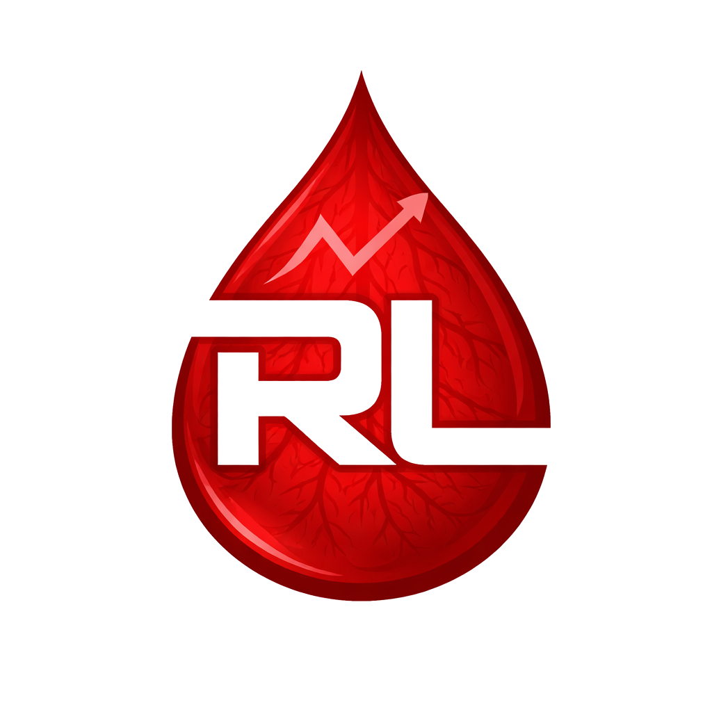

# RigLog 🩸💪



> One app. Multiple health signals. Clearer decisions.

RigLog is a personal health analytics desktop application built in Python,
designed to turn raw health data into actionable insights.

It currently supports glucose and activity analysis, with future modules planned for nutrition and training.

The goal is to combine multiple health data sources into a single application for analysis and visualisation, including:

- Glucose data
- Activity data
- Workout data
- Nutrition data

## Features

- Import glucose data from Diabetes:M (CSV)
- Interactive glucose dashboard with:
  - Ambulatory Glucose Profile (AGP)
  - Time-in-range metrics
  - Clickable glucose range filters
  - Meal-event drilldown chart
  - Unified active-filter state display
  - Daily average trends
  - Meal-event glucose distribution
- Glucose variability metrics:
  - Mean, SD, CV, GMI
- Insulin dose effectiveness analysis:
  - Standard vs actual carb ratios
  - Outcome-based recommendations
- Time-based improvement tracking (7-day comparison)
- Editable fields:
  - Carbohydrates (g)
  - Humalog (u)
  - Tresiba (u)
  - Notes
- Export professional PDF reports with charts
- Activity tracking via Fitbit integration:
  - Daily step import and sync
  - 7-day rolling averages
  - Goal adherence tracking (10k steps)
  - Streak and trend analysis
  - Daily and weekly charts with hover insights
- Unified home dashboard:
  - Live summary cards for glucose and activity
  - Quick navigation between modules

## Why RigLog?

RigLog was built to centralise and analyse personal health data,
starting with glucose monitoring.

The goal is to move beyond raw readings and provide:

- actionable insights
- trend analysis
- decision support for insulin dosing

Future modules will expand into nutrition, training, and cross-metric insights.

## Tech Stack

- Python
- PySide6 (desktop UI)
- Pandas (data analysis)
- Matplotlib (visualisation)
- SQLite (local database)
- ReportLab (PDF export)

## Project Status

Glucose module complete (v1)

- Interactive range filtering
- Meal-event drilldowns
- PDF export

Activity module MVP complete

Current capabilities:

- Full glucose data ingestion pipeline
- Advanced analytics (AGP, variability, dose effectiveness)
- Interactive desktop dashboard
- PDF report generation with charts

Next focus:

- Home dashboard auto-refresh after activity sync
- Refactor activity summary cards
- Rolling goal adherence metrics

## Roadmap

- Activity integration (steps, workouts)
- Idempotent data imports
- Food tracking
- Enhanced PDF reporting (tables, trends)
- Cross-metric insights (glucose vs activity)

## Getting Started

```bash
pip install -r requirements.txt
python -m app.main
```
