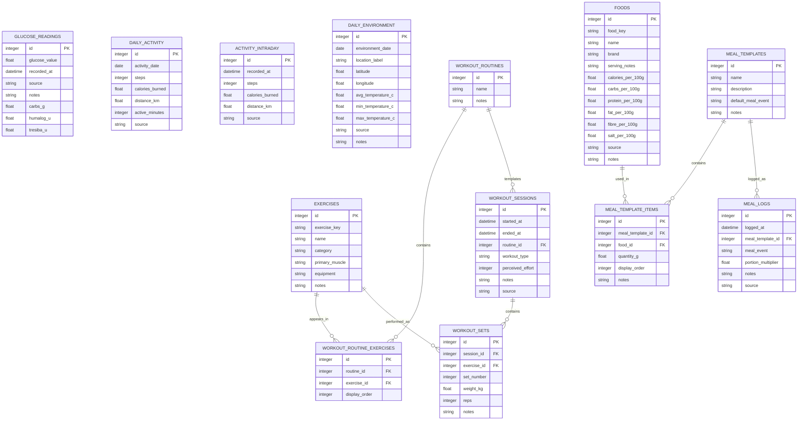

# 🧭 RigLog Entity Relationship Diagram

This document describes the current RigLog database model and key table relationships.

## 🧱 Database ERD

## 🔗 Relationship Notes

- `workout_routines` define reusable templates such as Push, Pull, and Legs.
- `workout_routine_exercises` links routines to exercises and preserves display order.
- `workout_sessions` represents completed workout events.
- `workout_sets` stores set-level performance data within each session.
- `exercises` acts as the stable exercise catalogue for both routine templates and completed workout sets.

## 📝 Grain Notes

- Glucose data currently has no direct foreign-key relationship to meals, activity, or workouts.
- Activity/glucose/environment analysis is handled in the service layer by aligning records by date or timestamp.
- `daily_activity` and `activity_intraday` intentionally use separate grains.
- `daily_environment` is location-aware to avoid double-counting glucose readings when multiple weather locations exist for the same date.
- Workout data separates planned structure from completed activity:
  - planned structure: `workout_routines`, `workout_routine_exercises`, `exercises`
  - completed activity: `workout_sessions`, `workout_sets`
- Workout calorie analysis is derived in the service layer by aligning `workout_sessions.started_at` / `ended_at` with `activity_intraday.recorded_at`; it is not represented as a physical table relationship.
- Nutrition/glucose analysis is handled in the service layer by aligning `meal_logs.logged_at` with `glucose_readings.recorded_at`; there is no physical foreign-key relationship between meals and glucose readings.
